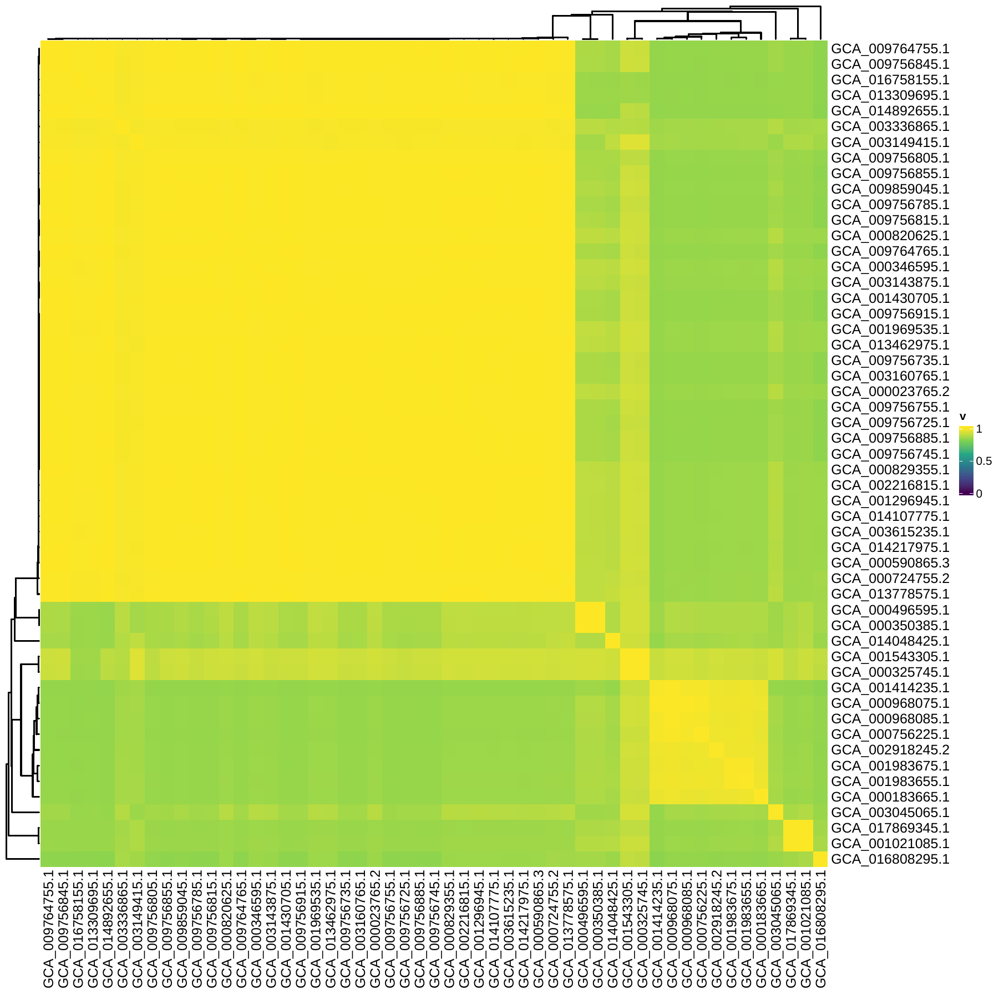
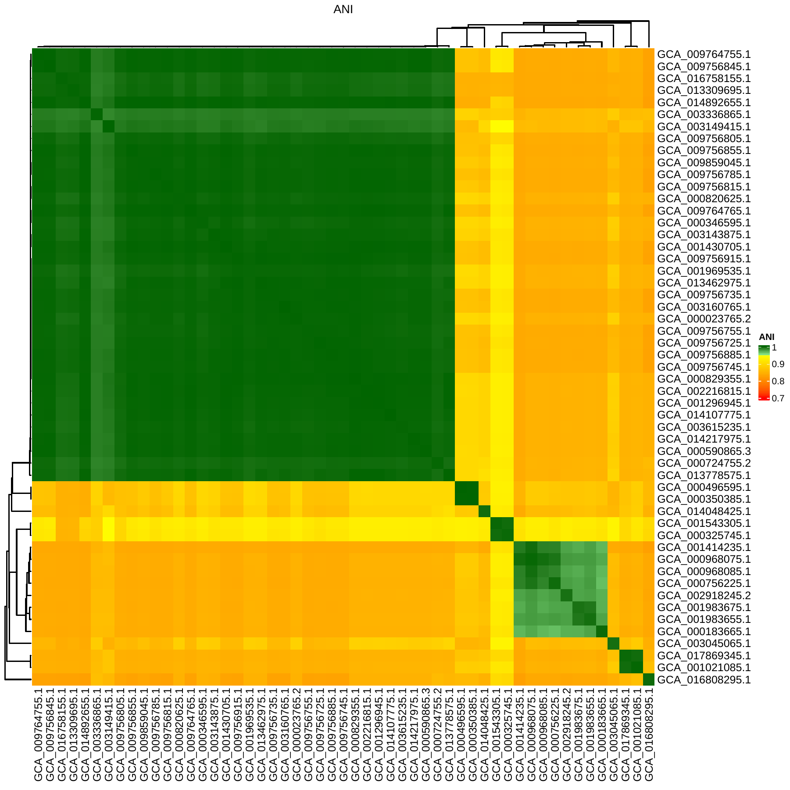

# ANI-typer

This is a collection of tools that are usefuly for analysing similarity
or distance data of different samples or isolates. The original focus
was on using ANI data for bacterial samples, but there are other data
where parts of the tools and approaches can be useful.

## ANI: Average Nucleotide Identity

Types:

- ANIm (nucmer)
- ANIb (BLAST)
- ANIt (tetra)
- fastANI
- mash

### [pyani](https://github.com/widdowquinn/pyani)

`pyani` is a Python3 module and script that provides support for
calculating average nucleotide identity (ANI) and related measures
for whole genome comparisons, and rendering relevant graphical summary output.

To calculate ANIm for a set of genomes in the `genomes` folder run the following

```bash
average_nucleotide_identity.py -i genomes/ -o pyani-out/ -m ANIm
```

> ANIm actually performs the following steps:
>
> 1. `nucmer --mum <ref.fas> <query.fas> -p <ref_vs_query>`
> 2. `delta-filter -1 <ref_vs_query.delta> > <ref_vs_query.filter>`

To calculate ANIb for a set of genomes in the `genomes` folder run the following

```bash
average_nucleotide_identity.py -i genomes/ -o pyani-out/ -m ANIb
```

The output folder will be created by the program. The ANI scores are located in
that folder: `pyani-out/ANIm_percentage_identity.tab` or `pyani-out/ANIb_percentage_identity.tab`.

### [fastANI](https://github.com/ParBLiSS/FastANI)

FastANI is developed for fast alignment-free computation of whole-genome Average Nucleotide Identity (ANI).

To run fastANI with default settings on a set of genomes in the `genomes` folder:

```bash
ls genomes > genome.list
fastANI --ql genome.list --rl genome.list --matrix -o fastANI-out
```

This will create `fastANI-out` and `fastANI-out.matrix`.

To convert the output into an ANI table, do the following:

```bash
cut -f1-3 fastANI-out | ./bin/table-cast.pl >fastANI.tsv
```

> `cut -f1-3` extracts the first three columns of the fastANI-out

## Scripts

All scripts are found in the [bin](bin) folder.

### ani-typer.pl

Based on ANI TSV and **type strain file** (TSV format with two columns: strain ID and species name) it can classify all the strains.
By default `0.95` is the minimum for classification. If a strain cannot be classified, then `Unknown` is printed as species name.
If there are multiple type strains that have higher than minimum ANI score, then all such species names are listed in decreasing order based on similarity.

```text
Usage:
	ani-typer.pl [-h | --help] -ani ani.tsv -type types.tsv [options]

Description:
	A tool to classify strains based on reference strains and ANI scores

Options:
	-h | --help
		Print help
	-all | --all
		Print all the ANI scores (default skips all ANI)
	-s | --select
		Print only the ANI scores for the reference strains (default skips all ANI)
	-no-sp | --no-species
		Do not add the species identification list to the end of the row (default would add it)
	-min=<int> | --min=<int>
		Change the minimum ANI score for species identifications to <int> (default is 0.95)
```

### ani2distance-phylip.pl

This script converts a TSV format ANI file into a phylip format distance matrix.

```math
d = 1 - ANI
```
Where $`ANI \in [0,1]`$

### fix-matrix.pl

This script converts the `.matrix` output of fastANI into a TSV format ANI matrix (where scores are 0-1).

### nj-for-phylip-distance-matrix.pl

This script calculates a neigbor-joining tree based on a phylip fomrat distance matrix and prints a newick format tree as output.

### Table scripts

Command line scripts for functions covered by the **reshape** package of **R**.
Scripts are writen in Perl, and no external libraries are needed to use them.

**table-cast.pl**

Converts a long format into a table format. It keeps the rows and columns in order of
first appearance in the input.

```bash
./bin/table-cast.pl melt > table
```

```text
# Long format (rowID, columnID, value)
ID1	length	5.1
ID1	width	3.5
ID1	species	setosa
ID145	length	6.7
ID145	width	3.3
ID145	species	virginica
```

```text
# Table format
	length	width	species
ID1	5.1	3.5	setosa
ID145	6.7	3.3	virginica
```

**table-melt.pl**

Converts a table to a long format, it melts the table.

```bash
./bin/table-melt.pl table > melt
```

**table-order.pl**

Order the rows of a table based on a file listing the row IDs.
> It also removes rows not found in the list file and duplicates rows that are mentioned multiple times.

```bash
./bin/table-order.pl list table >new-table
```

### tree-heatmap.R

This R script creates PDF file with a tree and heatmap based on newick tree and TSV file.
By default the output files is `heatmap.pdf`, but other filenames can be used by specifying as
the third argument.

```bash
Rscript bin/tree-heatmap.R example/rooted-ANI.nwk example/ANI.tsv plot.pdf
# or if it is executable, then
bin/tree-heatmap.R example/rooted-ANI.nwk example/ANI.tsv plot.pdf
```



### tree-ANI-heatmap.R

This R script creates PDF file with a tree and heatmap based on newick tree and TSV file.
By default the output files is `heatmap.pdf`, but other filenames can be used by specifying as
the third argument. There is a sharp transition when the ANI score drops below 95%
which is commonly used as the species cutoff.

```bash
Rscript bin/tree-ANI-heatmap.R example/rooted-ANI.nwk example/ANI.tsv ANIplot.pdf
# or if it is executable, then
bin/tree-ANI-heatmap.R example/rooted-ANI.nwk example/ANI.tsv ANIplot.pdf
```




### ggtree-ANI-heatmap.R

This R script creates PDF file with a tree and heatmap based on newick tree and TSV file.
You need to specify the `offset` variable for `gheatmap`, which has to be adjust for each data set.

```bash
# offset for larger data set ~0.01
# offset for few strains ~0.6
Rscript ./bin/ggtree-ANI-heatmap.R tree.nwk ANI.tsv 0.015
```

### Converting TSV distance matrix to phylip format

It is fairly easy to convert a TSV to phylip format.
Only the first row has to be changed. **It is important that the column names and row names are identical and folow the same order in the TSV file.**

```bash
cat distance.tsv | perl -ne 'if ($. == 1) {@a = split/\t/; print "  " . (scalar(@a) - 1) . "\n"} else { print }' >ditance.phy
```
